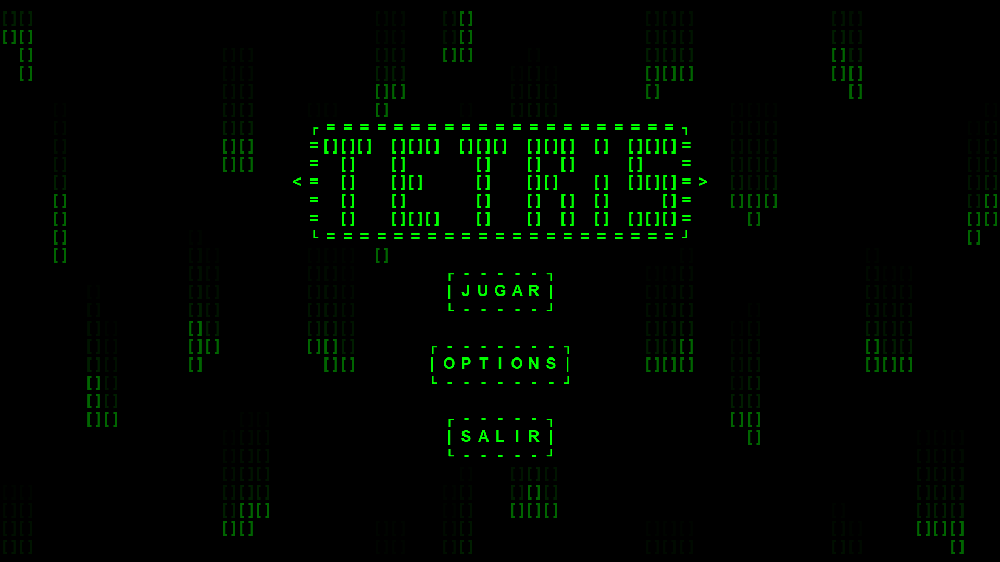
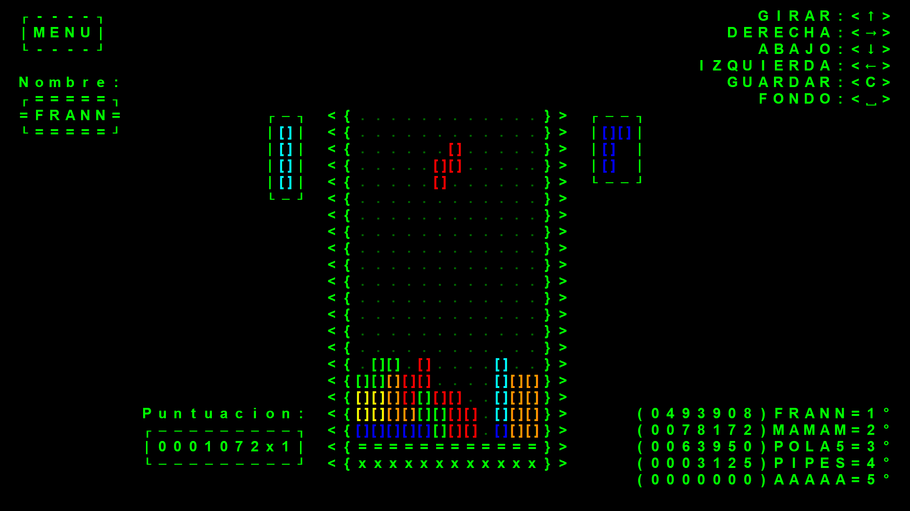
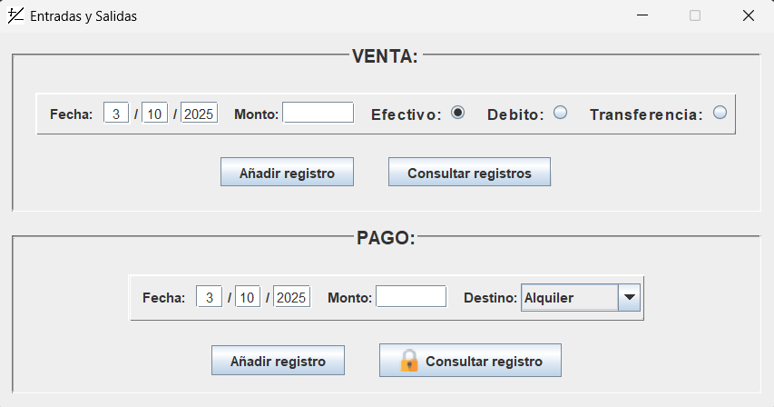
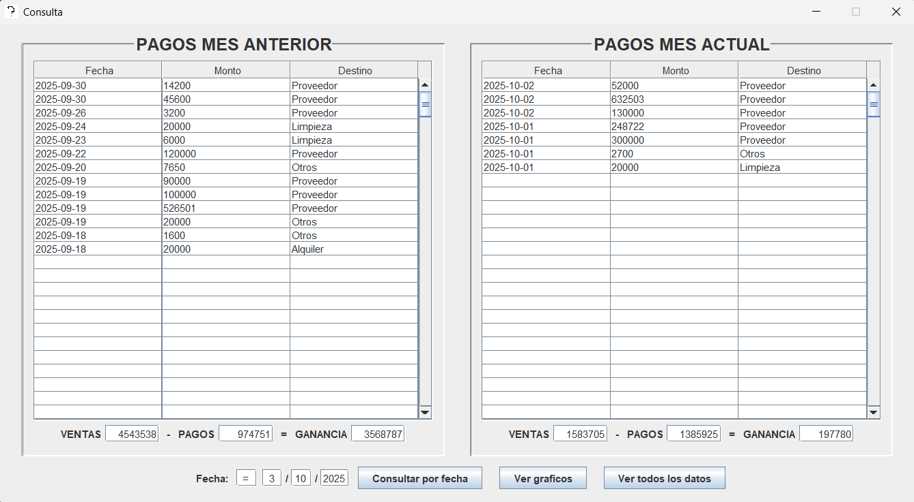

# MI PORTFOLIO

**Indice:**
- [Tetris](#tetris-java)
- [Control de caja](#control-de-caja-java-sql-access)
   

**Tecnologias utilizadas:**
- Java  
- SQL  
- Access  

## Tetris (Java)

Este proyecto es un tetris con un menu de opciones incluido para cambiar el volumen, los controles y los colores de las piezas, al precionar el jugar permite escribir el nombre y luego iniciar una partida

Al iniciar una partida vemos una pantalla donde en el centro las piezas comienzan a caer y tenemos muchos datos como la puntuacion, los controles, la siguiente pieza, entre otros. El que mas destaco es el marcador donde al iniciar una partida carga las puntuaciones que estan guardadas en un archivo de texto. Al perder, el marcador se actualiza teniendo en cuenta si tu puntuacion es mayor a alguna del marcador y si tu nombre aparece en el marcador, luego se actualiza el archivo de puntuaciones con los nuevos valores

Este es mi primer proyecto con java, la version actual es la V3.1.1, en su primer version se iniciaba el programa directo en una nueva partida y el codigo estaba terriblemente mal optimizado con 2000 lineas de codigo inecesarias. Este proyecto empeso por curiosidad de ver como seria crear un juego utilizando java, un lenguaje que no esta pensado para hacer juegos, y sin utilizar ningun motor de videojuegos. Poco a poco lo eh actualizado añadiendole nuevas funciones y mejorando el rendimiento hasta ahora

[`Show Code`](Tetris/src) | [`Download .zip`](Tetris/Tetris.zip)

## Control de caja (Java, SQL, Access)

El objetivo de este software es poder tener un registro sobre el movimiento de la caja en un comercio (Ventas y pagos) de manera rapida y eficaz. Fue desarrollado para la imprenta de mi madre a modo de practica, ella buscaba un programa simple, intuitivo y sobre todo rapido.

Este software tiene dos programas, uno para registrar ventas y pagos (EntradasSalidas) y otro para consultar las ganancias de todos los meses (Consultas).

En el programa llamado EntradasSalidas se pueden registrar los montos de las ventas y los pagos y tambien eliminarlos en caso de ingresar un valor no deseado, tambien esta pensado para evitar todo error al ingresar datos como que no deja ingresar fechas posteriores a la actual, no deja ingresar letras en el monto.

En el otro programa llamado Consultas aparecen los datos del mes anterior y el mes actual y debajo aparece el total de las ventas, el total de los pagos y la diferencia. Debajo de todo hay varias opciones, una para consultar los datos de un dia en especifico, otro para ver un grafico de barras con las ganancias de los ultimos 12 meses incluyendo el actual y por ultimo uno para ver todos los datos

Este software se comunica con una base de datos sql en Access, este tiene dos tablas, una de ventas y otra de pagos. Los programas al interactuar con la base de datos crean una coneccion, consultan o crean registros y cierran la coneccion, esta pensado asi para que el programa pueda esta abierto en varias computadoras interactuando con la misma base de datos, el software en las diferentes computadoras interactuan con la misma base de datos ubicada en una carpeta en la nube

[`Show Code`](ControlDeCaja/src) | [`Download .zip`](ControlDeCaja/ControlCaja.zip)